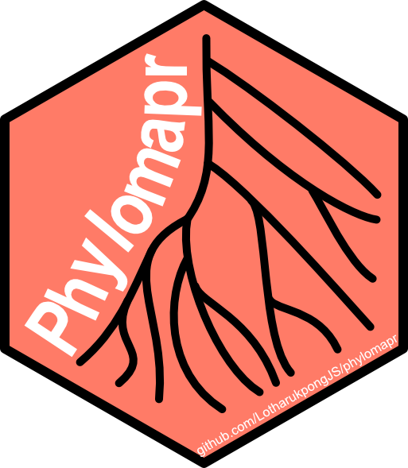

# phylomapr 
[](https://lifecycle.r-lib.org/articles/stages.html#experimental)


Gene founder events facilitate evolutionary innovations. `phylomapr` enables quick retrieval of precomputed gene age maps (phylomaps) in R. Gene age maps loaded from `phylomapr` integrate _seamlessly_ with [`myTAI`](https://github.com/drostlab/myTAI).

## Installation
```r
devtools::install_github("LotharukpongJS/phylomapr")
```

## Use Cases

### Retrieve gene age maps using `phylomapr`
Load the `phylomap` of _Apostichopus japonicus_ (Japanese sea cucumber) generated using the [GenEra](https://github.com/josuebarrera/GenEra).
```r
# either
Aj.map <- phylomapr::Apostichopus_japonicus.PhyloMap
# or alternatively
library(phylomapr)
Aj.map <- Apostichopus_japonicus.PhyloMap

head(Aj.map)
```
```
  Phylostratum                         GeneID
1            2 tr|A0A0B6VS88|A0A0B6VS88_STIJA
2            1 tr|A0A0G2R1N3|A0A0G2R1N3_STIJA
3            1 tr|A0A0H4BK46|A0A0H4BK46_STIJA
4            3 tr|A0A0X7YCD7|A0A0X7YCD7_STIJA
5            1 tr|A0A1B2ZDN7|A0A1B2ZDN7_STIJA
6            2 tr|A0A1X9J403|A0A1X9J403_STIJA
```
To get the data description.
```r
?Apostichopus_japonicus.PhyloMap
```
```r
Apostichopus_japonicus.PhyloMap   package:phylomapr    R Documentation

Phylomap of Apostichopus japonicus

Description:

     Gene ages inferred using GenEra on refence protein sequences from
     Uniprot proteomes. Note: DIAMOND was run using the ultra-sensitive
     mode.

Usage:

     Apostichopus_japonicus.PhyloMap
     
Format:

     A tibble with 30,032 rows and 2 variables:

     Phylostratum dbl Phylostratum (or gene age) assignment

     GeneID chr GeneID annotation from UniProt

Source:

     <https://genomebiology.biomedcentral.com/articles/10.1186/s13059-023-02895-z>
```
### Loading gene age maps into `myTAI`
[`myTAI`](https://github.com/drostlab/myTAI) facilitates evolutionary transcriptomic studies.
Below are some ways in which gene age maps retrieved via `phylomapr` can be integrate _seamlessly_ into `myTAI`.

#### Plot the developmental hourglass (on simulated gene expression data)
using simulated developmental gene expression of _Apostichopus japonicus_ (Japanese sea cucumber).

```r
Aj.map <- phylomapr::Apostichopus_japonicus.PhyloMap
```

Simulate developmental gene expression.

```r
# Set the random seed for reproducibility
set.seed(123)

# Generate log-normally distributed counts (controversial) for each gene and developmental stage, and
# Create a data frame with the count table
Aj.ExpressionMatrix <- tibble::tibble(
  GeneID = Aj.map$GeneID,
  `24H` = stats::rlnorm(length(Aj.map$GeneID), meanlog = 3, sdlog = 1),
  `48H` = stats::rlnorm(length(Aj.map$GeneID), meanlog = 3, sdlog = 1),
  `72H` = stats::rlnorm(length(Aj.map$GeneID), meanlog = 3, sdlog = 1)
)
```
```r
Aj.PES <- myTAI::MatchMap(Aj.map, Aj.ExpressionMatrix, remove.duplicates = FALSE, accumulate = NULL)
```
And test the hourglass on the simulated data.
```
myTAI::PlotSignature(tidyr::drop_na(Aj.PES))
```


#### Next, transform the simulated gene expression data

Note: this requires `myTAI (version > 1.0.1.0000)`.  
```r
Aj.PES.log2 <- myTAI::tf(tidyr::drop_na(Aj.PES),FUN = log2, pseudocount = 1)
hist(Aj.PES.log2$`24H`)
```


Compare this to the distribution of raw abundance (TPM).
```r
hist(Aj.PES$`24H`, breaks = 200)
```


```r
myTAI::PlotSignature(tidyr::drop_na(Aj.PES.log2))
```


## Citation
Citations are provided in the data description. Just put a `?` in front of the dataset.

## Acknowledgement
I would like to thank several individuals for making this mini-project possible.

First I would like to thank Hajk-Georg Drost for providing me with the intellectual environment that enabled this project.

Furthermore, I would like to thank Susana M. Coelho for hosting and facilitating this research, as well as the Max Planck Institute for Biology Tübingen and the Max Planck Society.

I also thank the BMBF-funded de.NBI Cloud within the German Network for Bioinformatics Infrastructure (de.NBI) (031A532B, 031A533A, 031A533B, 031A534A, 031A535A, 031A537A, 031A537B, 031A537C, 031A537D, 031A538A).
